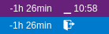

# `code-fingera-status`

A simple [Visual Studio Code](https://code.visualstudio.com/) extension
showing your [Fingera](http://www.fingera.com/) attendance status.



## Features
*Not much ;)*
 * Shows your overall (monthly) balance
 * Can show the time of your last arrival with the
   configurable *pomodoro* timer bar

## Config

```json
// Fingera Status Bar Notification

    // Fingera server hostname
    "fingera.host": "127.0.0.1",

    // Your Fingera user ID
    "fingera.user_number": 0,

    // Whether to time since the last arrival
    "fingera.show_arrival": true,

    // Treshold in minutes, when the next pause is appropriate :)
    "fingera.arrival_timer": 60,

```